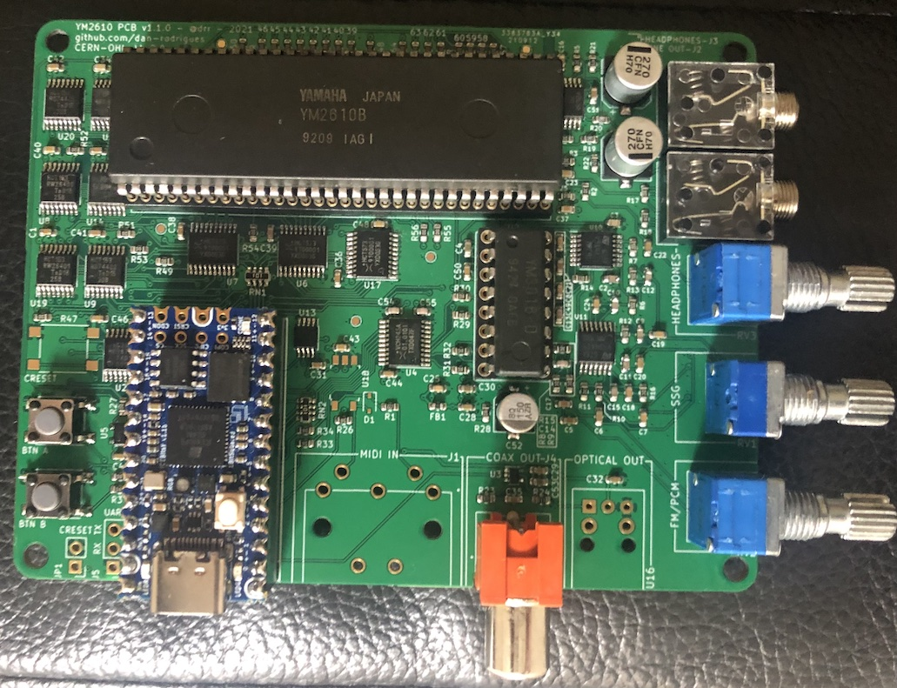
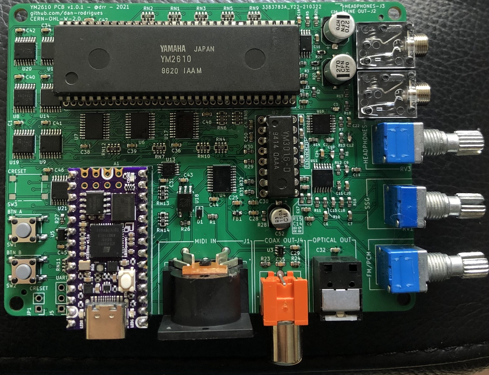

# YM2610 PCB

This project allows the user to control a YM2610(B) FM synthesis / ADPCM / SSG sound chip. Software is included to play back YM2610(B) VGM files which includes any Neo Geo arcade game and various others. It can also play certain Sega Genesis tracks using an included converter script. There is also a MIDI input that can be paired with new software to control the synth.

The goal is to make the complete system both low-cost and flexible which increases the complexity of the FPGA design but allows the use of cheaper hardware (i.e. a $35USD FPGA board and a fairly straightforward PCB).

The FPGA board used is the [iCEBreaker Bitsy](https://1bitsquared.com/collections/fpga/products/icebreaker-bitsy) which is also [open source](https://github.com/icebreaker-fpga/icebreaker). It's the small purple board in the bottom left of the photo. A custom vendor USB device and a companion host Python script is used for control. The USB core used is [no2usb](https://github.com/no2fpga/no2usb).

## Assembled PCBs

### v1.1.0 (partial)



### v1.0.1



## Video/Audio demos

* [Metal Slug 2 soundtrack](https://www.youtube.com/watch?v=nlexW8DgMvw) - Neo Geo VGM playback demo using S/PDIF audio output.
* [Thunder Force IV soundtrack](https://www.youtube.com/watch?v=O-OgxfgEnMU) - Sega Genesis playback demo using analog line-out output.

The Sega Genesis demos are made using an included converter script to compensate for incompatible hardware, different clock rates and differences in PCM playback.

## Features

### I/O

* S/PDIF compatible outputs. The digital sound sources from the OPNB (FM/PCM) can be heard using this output. The analog sound source (SSG) can only be heard with the 3.5mm analog outputs. Optical and coax outputs are included.
* 3.5mm line out.
* 3.5mm headphone out with attenutation pot.
* Separate attenuation pots for the combined FM/PCM and separate SSG sound sources. Their levels can be adjusted or muted independently.
* MIDI input (DIN-5). Default firmware includes library functions to read the MIDI messages into a minimal struct. There's also a simple FM demo.
* 2x user buttons. The default firmware uses them to cycle through the available sound sources.

The S/PDIF output is resampled to 48KHz and can be used to hear the original lossless output from the OPNB. It doesn't include the analog SSG output but most tracks don't use it.

The analog outputs include an active low pass filter (fC = approx 17KHz), independent attenutation pots for each sound source and can also be used to hear the analog SSG output.

### Debug

These aren't required but can be useful for debugging.

* UART header
* CRESET jumper
* CRESET button

## Operation

Included is also an SoC implementation for the FPGA (in the `rtl/` directory) and firmware that runs on this SoC (in the `fw/` directory). There's also a set of helper scripts to control the SoC over the USB port.

ADPCM samples are fetched from the FPGA board PSRAM. The host PCB itself doesn't include any extra memory, only some standard logic to mux the PCM buses to the limited number of FPGA IO available. The RAM is 64MBit which is smaller than the 128MBit address space of samples, but the player script relocates and remaps samples starting from address 0 if needed. This means tracks that use the 128MBit space will work assuming the total PCM size of the track is less than 64MBit, which it likely is.

Both the original YM3016 DAC and the FPGA have access to the digital outputs of the synth. This means both analog output (using the DAC) and digital output (using the coax/optical output) is available. S/PDIF encoding is done on the FPGA and made available from the digital outputs.

The synth has a pair of PCM buses that work in parallel and the board only includes a single RAM which must be shared. The slower of the two buses is automatically paused when the faster bus begins a read which handles the contention issue. Only 4 FPGA IOs are used to read the 26 PCM bus pins which is handled using standard logic on the board.

The iCEBreaker Bitsy USB port is used to upload music data and also for control. The USB stack used and firmware can be customised as needed i.e. to allow a PC MIDI interface to drive the OPNB, or to record the raw digital output to store on a file, or any other possible use.

There is only 128KByte of RAM available to the software which would limit the maximum size of track that can be played. The track commands are streamed over USB to get around this limit which means tracks can be arbitrarily large. A pair of 8KByte buffers are read/written to support playback of large tracks.

Synth commands are output using a pair of 8bit shift registers, running at the same 8MHz clock as the synth itself. This reduces the needed IO count without being a bottleneck.

## Usage

### Build and flash

This project uses submodules which must be cloned first.

```
git submodule update --init --recursive
```

Building and flashing FPGA bitstream (which implements the SoC):

```
make dfuprog
```

Building and flashing SoC firmware:

```
make -C fw dfuprog
```

### Playing VGM files

After flashing the firmware, the RGB LED should slowly flash indicating that it's ready to use. Either `vgz` or `vgm` files can be used.

```
./scripts/usb_ctrl.py track.vgm
```

More details about the scripts can be found in their [README](scripts/README.md) file.
