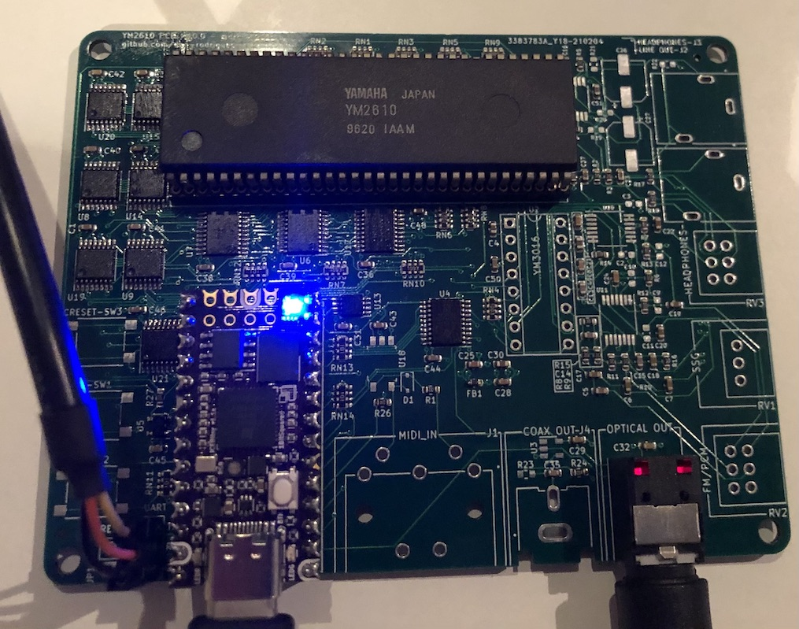

# YM2610 PCB (WIP)

This project consists of a PCB, which works with a Teensy-form factor FPGA board (iCEBreaker Bitsy), which controls a Yamaha YM2610 FM synthesis / ADPCM / SSG sound chip. It also contains the software needed to play music in VGM format and will eventually support MIDI input using the DIN-5 jack.

ADPCM samples are fetched from the PSRAM as needed.

The iCEBreaker Bitsy USB port is used to upload music data and also for control.

## TODO

This project is still in early development and major functionality is still being added.

There are a few known issues in the 1.0.0 version of the PCB which are being fixed.

