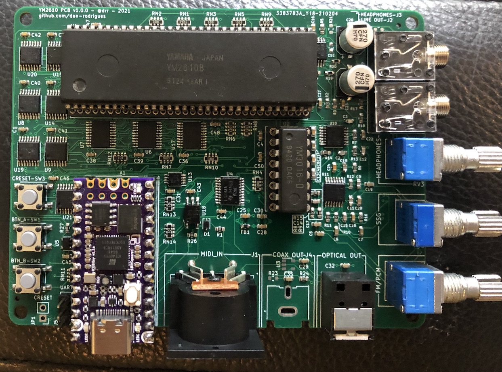

# YM2610 PCB (WIP)

This project consists of a PCB, which works with a Teensy-form factor FPGA board (iCEBreaker Bitsy), which controls a Yamaha YM2610 (OPNB) FM synthesis / ADPCM / SSG sound chip. It also contains the software needed to play music in VGM format and supports MIDI input using the DIN-5 jack.

ADPCM samples are fetched from the FPGA board PSRAM as needed. The host PCB itself doesn't include any extra memory, only some standard logic to mux the PCM buses to the limited number of FPGA IO available.

The iCEBreaker Bitsy USB port is used to upload music data and also for control. The USB stack used and firmware can be customised as needed i.e. to allow a PC MIDI interface to drive the OPNB, or to record the raw digital output to store on a file, or any other possible use.

## Partially assembled PCB (v1.0.0)

## Video/Audio demos

* [Metal Slug 2 soundtrack](https://www.youtube.com/watch?v=nlexW8DgMvw) - Neo Geo VGM playback demo using S/PDIF audio output.

## TODO

This project is still in early development and major functionality is still being added to the gateware / firmware.

A new revision of the PCB with many changes to the analog section is also being tested. What's currently in the main branch is out of date but the newer revision will be available in one of the non-default branches.

